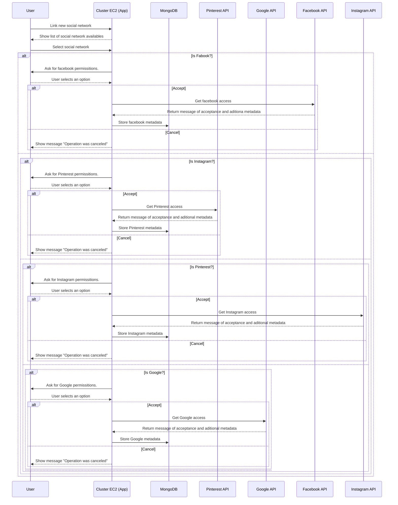
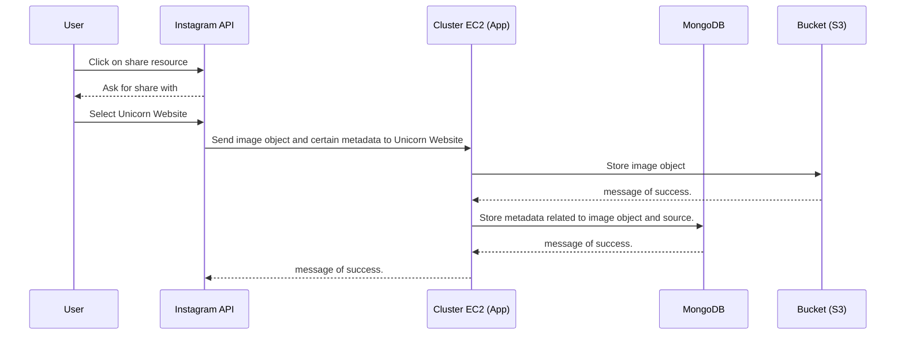
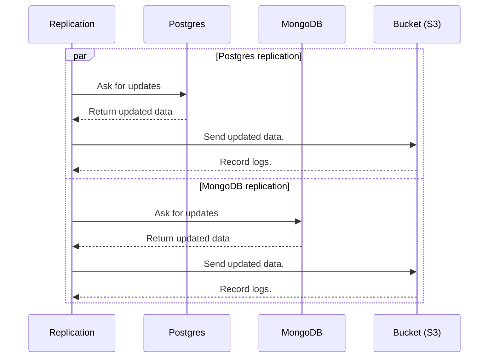
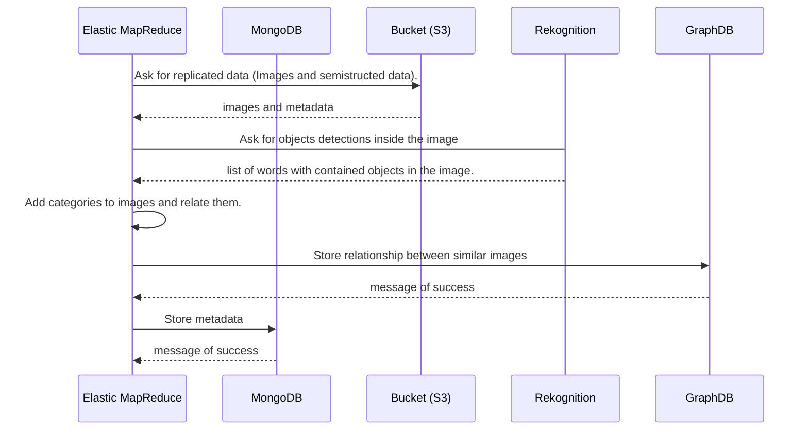
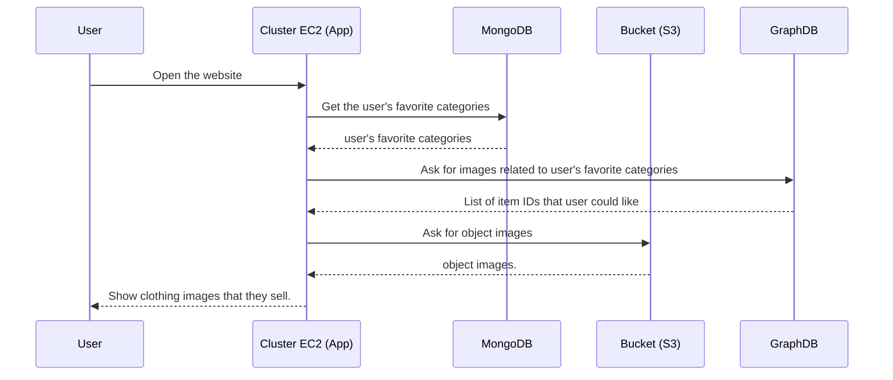

## Sequence Diagram - Adding new social network

## Sequence Diagram - Storing images

## Sequence Diagram - Data Replication

## Sequence Diagram - Feature extraction

## Sequence Diagram - Recommendation system
